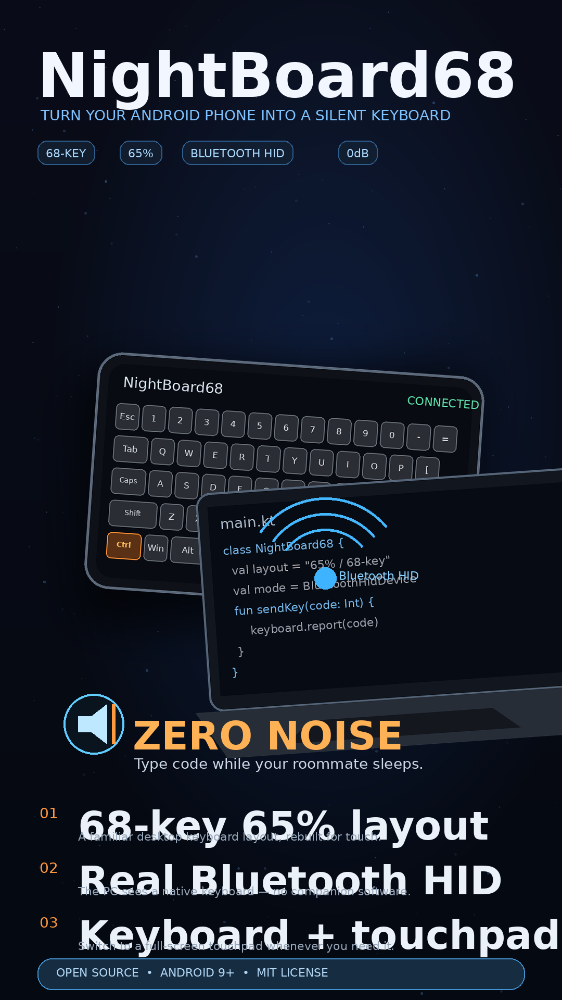

# NightBoard68

<p>
  简体中文 · <a href="README_EN.md">English</a>
</p>

> **当前版本：v1.3.0**（基于上游 [v1.2.1](https://github.com/elysia395/NightBoard68/releases/tag/v1.2.1)，
> 版本号与上游仓库对齐。本分支全部改动点见下方 [「v1.3.0 改动点」](#v130-改动点相对上游-v121)）

把 Android 手机横过来，变成一台 **68 键 65% 配列的蓝牙键盘（+ 触控板）**。
电脑把手机识别成一台真正的蓝牙 HID 设备，**电脑端无需安装任何软件**。

<table>
  <tr>
    <td width="42%"></td>
    <td width="58%"></td>
  </tr>
</table>

## 这是什么？（小白版，30 秒看懂）

**一句话：让你的手机变成电脑的无线键盘 + 触控板。**

有两种玩法，随时在 App 里一键切换：

| | 📶 蓝牙模式 | 🚀 局域网模式 |
|---|---|---|
| 电脑要装东西吗 | **什么都不用装** | 双击运行一个小工具（免安装） |
| 打字延迟 | 正常（15~40ms） | **更低更稳**（2~10ms） |
| 适合场景 | 图书馆、别人的电脑 | 宿舍自己电脑、追求手感 |

**它能干嘛**：深夜宿舍敲代码不吵舍友、图书馆没键盘时应急、躺床上控制客厅电脑、
给电视盒子打字，还能当触控板用。

## 3 步上手（蓝牙模式，零安装）

1. **装 App**：从 [Releases](../../releases) 下载 APK 装到手机，打开，
   允许「附近的设备」权限，等主页显示「键盘就绪」
2. **配对**：主页点 **「让电脑发现我」**，电脑上：设置 → 蓝牙和其他设备 →
   添加设备 → 蓝牙 → 选**你手机的蓝牙名字** → 手机上点「配对」
   （键盘是手机上的服务，列表里不会出现叫 NightBoard68 的设备）
3. **开打**：App 里点「开始打字」，电脑光标点进输入框直接敲 ✔

> 打字小技巧：点一下 **Ctrl**（橙框亮起）→ 再点 **C** = Ctrl+C，单指就能完成组合键；
> **双击 Shift = 大写锁定**（连打字母全大写，再点一下 Shift 解锁）

## 局域网模式（延迟更低，可选）

1. **电脑**：从 Releases 下载 `NightBoardAgent.exe`，**双击运行**即可
   （免安装、不用管理员；首次运行防火墙弹窗点「允许」）
2. **网络**：手机和电脑连**同一个 WiFi**（电脑连手机热点效果最好）
3. **连接**：App 主页选「局域网模式」，键盘顶部出现 `●局域网 xms` 就是连上了

- 搜不到电脑？App 设置里手动填电脑 IP（电脑 cmd 输 `ipconfig` 看 IPv4 地址）
- 只想用蓝牙？不运行 exe、保持蓝牙模式，一切照旧
- 想开机自动启动代理？命令行执行一次 `NightBoardAgent.exe --install`
  （写入当前用户的注册表 Run 键，开机后自动最小化运行；`--uninstall` 关闭自启）
- 连接不对劲？点「检查连接」一键重新探测

## 竖屏模式（躺着单手玩）

主页点「🖐 竖屏模式」，自上而下：**触摸板 → 快捷键区 → 编程符号行 →
F1~F12 → 数字行 → 手机式 26 键**。

- **快捷键区**：Ctrl / Alt / Tab / Win / Esc 点按锁定 + 6 个自定义组合键槽
  （**长按槽位即可编辑**，比如改成 Ctrl+Shift+T、Alt+F4）
- **触摸板**：单指移动、轻点=左键、**长按=右键**、双指上下滑=滚动、
  **右缘滚动条**上下滑=滚动（嫌双指难用就用这个）
- 滚动力度不合适？设置页有「触摸板滚动灵敏度」

## 常见问题（FAQ）

<details>
<summary><b>电脑搜不到手机 / 配对后打不了字？</b></summary>

如果电脑以前配对过这台手机，先在电脑蓝牙设置里**删除旧配对**再重新添加，
否则电脑读不到键盘服务。以后升级 APK 不需要重新配对。
</details>

<details>
<summary><b>局域网模式搜不到电脑？</b></summary>

① 确认电脑上的 NightBoardAgent.exe 正在运行、防火墙已放行；
② 确认手机和电脑在同一网段（路由器开了 AP 隔离的先关掉）；
③ 都不行就在 App 设置里手动填电脑 IP（支持带端口：`192.168.1.8:6868`）。
</details>

<details>
<summary><b>打字延迟高 / 键盘跟手性差？</b></summary>

切到局域网模式（同 WiFi 下典型 2~10ms，蓝牙典型 15~40ms 且受 2.4G 干扰抖动）。
</details>

<details>
<summary><b>新版本 APK 装不上（提示签名/版本问题）？</b></summary>

本分支构建与上游官方构建签名不同：先卸载旧版再安装（只丢失 App 内设置）。
</details>

## v1.3.0 改动点（相对上游 v1.2.1）

### 新增：局域网模式（低延迟通道）
- 手机通过 WiFi 直连电脑端 `NightBoardAgent`，延迟从蓝牙的 15~40ms 降到 **2~10ms**
  （热点直连更低），触控板吞吐不受 HID 报告率限制
- 与蓝牙拆成**两个独立连接模式**，主页 / 键盘页右上角一键切换，互不干扰；
  蓝牙模式行为与上游完全一致
- 电脑端代理**免安装**：单文件 13KB exe（C# / Win32 SendInput），UDP 6869 自动发现
  + TCP 6868 传输，支持手动填 IP 兜底
- **连接检查**：主页与键盘页一键探测当前模式；心跳每秒测 RTT，状态条实时显示延迟
- 局域网链路键码与蓝牙 HID 报告同一套码表，逻辑层零分叉

### 新增：电脑端代理完善度
- **长按连发**：Windows 对注入按键不做硬件式自动重复，代理侧模拟（450ms 延迟 +
  30 次/秒），局域网模式下按住退格/字母可连发，与蓝牙模式行为对齐
- **键盘灯回传**：CapsLock 等状态经 TCP 回传，键帽实时点亮（与蓝牙一致）
- **鼠标注入修复**：`INPUT_MOUSE` 类型常量错误导致鼠标事件全部无效（已修复并实测）

### 新增：竖屏模式
- 竖屏专属布局：触摸板 → 快捷键区（Ctrl/Alt/Tab/Win/Esc + 6 个自定义槽）→
  编程符号行 `( ) { } [ ] ; ' \` \ = /` → F1~F12 → 数字行 → 手机式 QWERTY
  （底行 `,` 空格 `.` 回车，宽退格）
- 自定义快捷键：**长按槽位编辑任意组合键**（修饰键多选 + 主键下拉），持久化保存
- 与横屏 68 键完全共存，互相一键切换

### 新增：键盘与触摸板交互
- **双击 Shift = 持续锁定**（280ms 内），替代低频使用的 CapsLock；锁定时键帽
  下缘亮橙条，再点解锁；单击仍为一次性锁存
- 触摸板**单指长按 500ms = 右键**（原双指轻点右键改为长按，避免误触）；
  双指滑动 = 滚动不变
- 触摸板**右缘滚动条**：单指贴右缘上下滑 = 滚动（双指滑动的平替方案）
- 滚动灵敏度可在设置页调节（8~60px/格）
- 触摸板慢速拖动不再丢步（亚像素位移累积）
- 触摸板滚动条手指不再误触右键/光标

### 修复（含上游遗留问题）
- **修饰键点按锁定失效**：上游版本中锁存的修饰键（如 Ctrl）在手指抬起时即被
  误清除，「点 Ctrl → 点 C = Ctrl+C」实际不可用，只有多指同按有效；现单指
  点按锁定流程完整可用
- 自定义快捷键行最后一个槽位因宽度计算错误溢出屏幕

### 其他
- 所有新功能均可在设置中关闭/调整；不使用局域网模式时行为与上游一致
- 新增文件：`LanKeyboard.kt` / `InputHub.kt` / `OneHandActivity.kt` /
  `OneHandView.kt` / `ShortcutStore.kt` / `pc-agent/*`

## 为什么做这个（开发缘由）

我喜欢晚上在宿舍学编程，但机械键盘的敲击声会吵到已经休息的舍友。
声音进不了耳机——只要还想敲代码，噪音问题就绕不过去。

于是我想到：**手机触屏打字是零噪音的**，而且手机就在手边、横过来尺寸正好
接近一块 60% 机械键盘。如果手机能伪装成一台真正的蓝牙键盘，电脑零安装、
不占充电口、不依赖网络，就是完美的深夜键盘。

调研后发现现成的开源方案（如 [android-bt-remote](https://github.com/jqssun/android-bt-remote)、
[Atharok/BtRemote](https://gitlab.com/Atharok/BtRemote)）已经实现了「手机变蓝牙键盘」，
但它们的键盘界面都是为遥控/随手输入设计的通用布局——**没有人做 65% 标准配列，
没有人为主力打字/写代码优化横屏体验**。

所以就有了 NightBoard68：

- **68 键 65% 配列**：数字排、右下方向键、Fn 组合出 F 区和编辑键，键位与主流
  65% 机械键盘一致，肌肉记忆无缝迁移
- **触屏专属交互**：修饰键点按锁定（点 Ctrl → 点 C = Ctrl+C，单指就能完成），
  这是实体键盘做不到的
- **零噪音**：夜里只听得见你的思路
- **零安装、零依赖**：蓝牙模式电脑什么都不用装；App 本身也只有 2MB、零第三方库

## 适用场景

- 🌙 **宿舍夜学**：舍友睡了，你想敲代码——这是它诞生的场景
- 📚 **图书馆 / 自习室**：没有键盘或不想带键盘的时候
- 🛋️ **躺沙发 / 躺床上**：控制客厅电脑、HTPC，键盘+触控板二合一
- 🖥️ **临时演示 / 抢救**：键盘坏了、没电了，手机应急顶上
- 📺 **Android TV / 投影**：给电视盒子输入文字

## 功能

### 键盘（横屏 68 键）
- 68 键 65% 配列，多指同按（左手 Ctrl 右手 C）
- 修饰键**点按锁定**：点一下 Ctrl（橙框亮起）→ 点 C → 自动释放；再点一次取消
- **双击 Shift = 持续锁定**（替代 CapsLock，锁定期间字母全大写、符号全上档）
- 修饰键**组合发送**：Ctrl 已锁定时点 Shift = 发出 Ctrl+Shift（切换输入法）；
  已锁定的 Shift 再点一次 = 单发 Shift（中文输入法切中英文）
- **Fn 层**：数字排 → F1~F12，Esc → `` ` ``，Del → PrtSc，PgUp/PgDn ↔ Home/End
- 按住自动连发（蓝牙/局域网均支持）；Caps Lock 状态由电脑回传、键帽实时点亮
- 键缝命中兜底：快速敲击落在键缝上也能正确判定，不留死区

### 触控板
- 顶部按钮一键切换：整屏变大触控板（竖屏模式顶部常驻触摸板）
- 单指移动 / 轻点=左键 / **长按=右键** / 双指上下滑=滚轮 / **右缘条上下滑=滚轮**
- 滚动灵敏度设置页可调；慢速拖动不丢步

### 连接与保活
- 前台服务保活：退出键盘页、锁屏不断连，通知栏一键回到键盘
- 蓝牙：自动回连上次连接的电脑；也可在主页手动点击重连
- **双模式独立切换**：蓝牙 / 局域网按需选择，「检查连接」一键探测

### 设置
- 触感反馈强度 0~255 无级调节（拖动实时试震）
- 键盘页面独立亮度（最低 5%，夜间不刺眼，退出自动恢复）
- 修饰键模式切换（点按锁定 ↔ 按住生效）
- 自动回连开关
- 触摸板滚动灵敏度
- 局域网电脑 IP 手动指定

## 配列

横屏 68 键（65%）：

```
Esc  1  2  3  4  5  6  7  8  9  0  -  =  Backspace   Del
Tab  Q  W  E  R  T  Y  U  I  O  P  [  ]  \           PgUp
Caps A  S  D  F  G  H  J  K  L  ;  '  Enter          PgDn
Shift   Z  X  C  V  B  N  M  ,  .  /  Shift   ↑      End
Ctrl Win Alt        Space        Alt Fn Ctrl  ←  ↓  →
```

竖屏模式（自上而下）：

```
┌────────────────────────┐
│        触 摸 板          │ 右缘 = 滚动条
├────────────────────────┤
│  Ctrl  Alt  Tab  Win  Esc  │
│  快捷 ×6（长按编辑组合键）  │
│ ( ) { } [ ] ; ' ` \ = /    │ 编程符号行
│  F1 F2 F3 ………… F12       │
│  1 2 3 4 5 6 7 8 9 0      │
│  Q W E R T Y U I O P      │
│   A S D F G H J K L       │
│ Shift Z X C V B N M   ⌫   │
│ ,     空格     .   回车    │
└────────────────────────┘
```

## 要求

- 手机：Android 9.0+（使用系统 `BluetoothHidDevice` profile）
- 电脑：
  - 蓝牙模式：任何支持蓝牙键盘/鼠标的系统（Windows / macOS / Linux / Android TV）
  - 局域网模式：Windows 10/11 + `NightBoardAgent.exe`（macOS/Linux 暂未适配，欢迎 PR）

## 使用

### 蓝牙模式（零安装）

1. 从 [Releases](../../releases) 下载 APK 安装到手机，打开并授予
   「附近的设备」权限，等主页显示「键盘就绪」
2. 点 **「让电脑发现我」**，然后电脑：设置 → 蓝牙和其他设备 → 添加设备 → 蓝牙
3. 选择**手机的蓝牙名字**（键盘是手机上注册的服务，不会出现叫
   NightBoard68 的独立设备），手机上确认配对
4. 点「开始打字」，电脑光标点进输入框直接敲

### 局域网模式（低延迟，可选）

1. 电脑：从 Releases 下载 `NightBoardAgent.exe` 双击运行（防火墙弹窗点允许）；
   或在 [`pc-agent/`](pc-agent/) 目录自行编译
2. 手机与电脑连同一个 WiFi（或电脑连手机热点）
3. App 主页切换到「局域网模式」，状态条出现 `●局域网 xms` 即已连接；
   搜不到就在设置里手动填电脑 IP

> **提示**：如果电脑以前把这台手机当手机配对过，请先删除旧配对再重新添加，
> 否则电脑读不到键盘服务。以后升级 APK **不需要**重新配对（除非 Release 说明
> 里特别提到描述符变更）。

## 自己编译

```bash
gradle :app:assembleDebug
# 产物：app/build/outputs/apk/debug/app-debug.apk
```

零第三方依赖，只需要 Android SDK（compileSdk 34）和 JDK 17+。
改键位映射只需编辑
[`app/src/main/java/com/nightboard/keyboard68/KeyLayout.kt`](app/src/main/java/com/nightboard/keyboard68/KeyLayout.kt)。

电脑端代理（局域网模式用，Windows 自带编译器即可构建）：

```bat
cd pc-agent && build.bat
:: 产物：pc-agent/NightBoardAgent.exe（免安装单文件）
```

## 技术实现（一句话版）

`BluetoothHidDevice`（Android 9+ 的 HID Device profile）注册键盘+鼠标组合设备
（Report ID 1 = 键盘 8 字节报告，Report ID 2 = 鼠标 4 字节报告），电脑把它当
原生蓝牙 HID 设备；局域网通道用「UDP 6869 发现 + TCP 6868 传输（换行分隔 JSON，
键码与 HID 报告同表）」对接电脑端 `NightBoardAgent`（Win32 SendInput 注入 +
长按连发模拟），`InputHub` 按当前模式统一路由（蓝牙/局域网独立切换）；UI 为
单 View 自绘（`onDraw` 画键帽 + `onTouchEvent` 多指调度），命中判定带 hit-slop 兜底。

## 已知限制

- 组合键（如 Ctrl+Shift 切输入法）有 300ms 延迟——这是在「组合键」和
  「修饰键+字母」之间消歧的设计取舍
- 部分国产 ROM（MIUI/ColorOS 老版本）对 HID device profile 有限制，
  若一直显示「正在注册蓝牙键盘…」请反馈机型
- 局域网模式的电脑端目前仅支持 Windows；macOS / Linux 需要等价的
  SendInput 替代（欢迎 PR）
- 触控板滚轮方向如与习惯不符可在 issue 里喊一声，一行符号的事

## 致谢与参考

- [Arian04/android-hid-client](https://github.com/Arian04/android-hid-client) 与
  [jqssun/android-bt-remote](https://github.com/jqssun/android-bt-remote) /
  [Atharok/BtRemote](https://gitlab.com/Atharok/BtRemote) —— 验证了
  `BluetoothHidDevice` 路线的可行性
- [USB HID Usage Tables](https://usb.org/document-library/hid-usage-tables-and-digitizers-table-reference-guides) /
  [Understanding HID report descriptors](http://who-t.blogspot.com/2018/12/understanding-hid-report-descriptors.html)

## 许可

[MIT](LICENSE)
